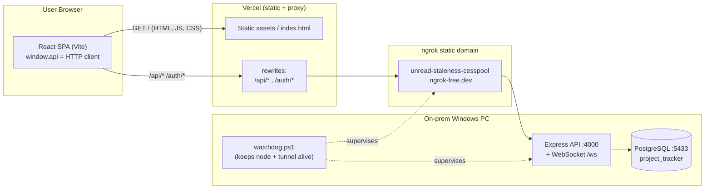
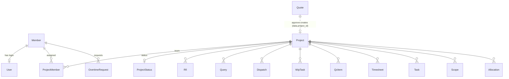
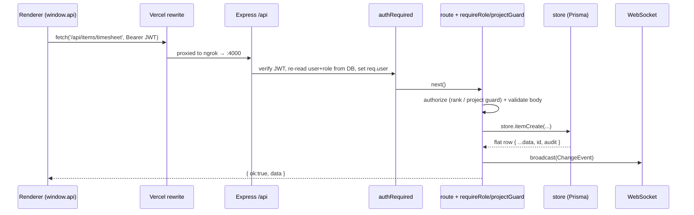
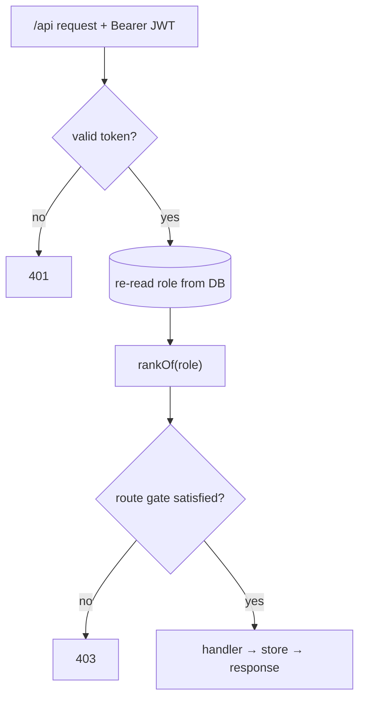
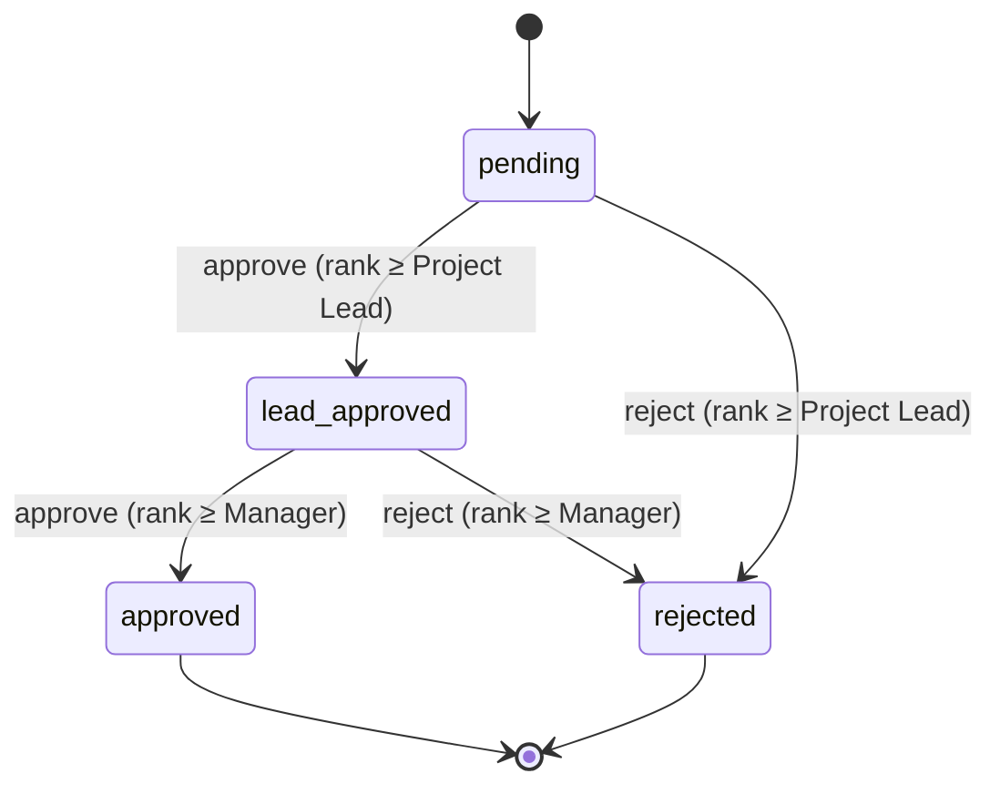
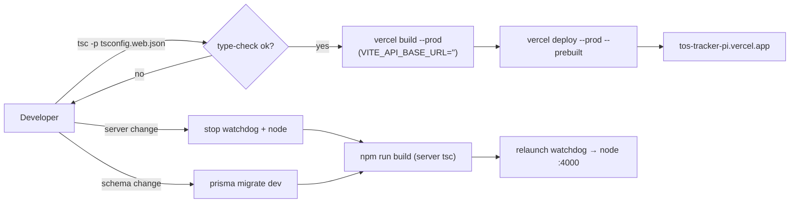

# TOS Tracker — System Design (Architecture)

Technical/architecture companion to [DOCUMENTATION.md](DOCUMENTATION.md). Covers the
deployment topology, technology stack, data model, request lifecycle, authentication &
authorization, real-time strategy, module map, scheduled jobs, security, and the key design
decisions and their trade-offs.

---

## 1. Overview

TOS Tracker is a **two-tier web application**:

- **Tier 1 — Client:** a React 19 + TypeScript single-page app (Vite build) served as static
  assets from **Vercel**.
- **Tier 2 — Backend:** a Node.js + Express + Prisma service backed by **PostgreSQL**, running
  **on-premises** on a company PC and exposed to the internet through an **ngrok** static
  tunnel.

Vercel acts as both the static host **and** a same-origin reverse proxy: it rewrites
`/api/*` and `/auth/*` to the tunnel, so the browser only ever talks to its own origin. This
sidesteps CORS and third-party-cookie problems and keeps the auth token same-origin.

The codebase retains its **Electron desktop origin** (a `window.api` IPC contract). The web
build reimplements that exact contract as an HTTP client (`web/api.ts`), so the entire
renderer is unchanged between desktop and web.



---

## 2. Technology stack

| Layer | Technology |
|-------|-----------|
| UI | React 19, TypeScript, Vite 5, hand-rolled CSS (design tokens, light/dark) |
| Client data | React Context (`AppContext`, `DataContext`), `window.api` HTTP client, 45s polling |
| Charts/UX | Custom SVG charts (Donut, Bars, BurnUp), Gantt, command palette, Document Picture-in-Picture (pop-out timer) |
| API | Node.js, Express 4, JSON envelope `{ ok, data, error }` |
| ORM/DB | Prisma 6 + PostgreSQL |
| Auth | JWT (`jsonwebtoken`), `bcryptjs` password hashing |
| Realtime | `ws` WebSocket server at `/ws` |
| Files | `multer` upload → local `STORAGE_DIR` |
| Email | `nodemailer` (SMTP) + scheduled digest |
| Validation | `zod`, plus boundary checks in routes |
| Exports | `exceljs` (Excel), HTML→print (PDF), `.doc` blobs |
| Hosting | Vercel (frontend) + on-prem Node/PG + ngrok tunnel; PowerShell watchdog |

---

## 3. Repository layout

```
Project Tracker/
├─ src/
│  ├─ main/ , preload/        # Electron shell (legacy; not in the web deploy)
│  └─ renderer/src/           # the SPA (shared by desktop + web)
│     ├─ App.tsx              # shell: top bar, sidebar, feature slot, routing-by-state
│     ├─ context/
│     │  ├─ AppContext.tsx    # auth/session, members, settings, role flags
│     │  └─ DataContext.tsx   # shared cached data layer (projects/tasks/timesheets/…)
│     ├─ components/          # feature windows, modals, dashboards, tables, charts
│     ├─ tabs/                # per-project tabs (RFI, QC, Tasks, Timesheet, Dashboard, …)
│     ├─ lib/                 # hours, people, filterPresets, usePopout, imageStatus
│     ├─ web/api.ts           # HTTP implementation of the window.api contract
│     ├─ risk.ts , forecast.ts, report.ts   # analytics
│     ├─ roles.ts , disciplines.ts          # domain vocab + rank math
│     └─ types.ts             # shared types + the window.api interface
├─ server/
│  ├─ prisma/schema.prisma    # PostgreSQL schema (hybrid relational + JSONB)
│  └─ src/
│     ├─ index.ts             # bootstrap: express, /health, routers, ws, schedulers
│     ├─ auth.ts              # JWT, authRequired, requireRole, rankOf, /auth routes
│     ├─ routes.ts            # /api routes (the window.api surface)
│     ├─ store.ts             # data operations (returns flat row shapes)
│     ├─ tables.ts            # item-type registry + flatten/toColumns helpers
│     ├─ ws.ts                # WebSocket broadcast (ChangeEvent)
│     ├─ email.ts , digest.ts # SMTP send + scheduled digest
│     └─ *seed*/*migrate*/*creds*  # operational scripts
├─ scripts/watchdog.ps1       # keeps node + tunnel alive
├─ vercel.json                # build + same-origin rewrites
└─ docs/                      # this documentation
```

---

## 4. Data model

**Design: hybrid relational + JSONB.** Identity/relational entities get real typed columns
and foreign keys (referential integrity, `ON DELETE CASCADE`). The variable per-type item
content lives in a **`data JSONB`** column — one table per item type — preserving flexible
row shapes and original id spaces, so the REST contract matches the original JSON store.



### Relational tables
- **Member** — name, email, role, discipline, engagement, `skills` (JSON), status.
- **User** — login: email (unique), `passwordHash`, role mirror, `memberId` (FK, SetNull).
- **Project** — name, client, location, discipline, type, `quotedHours`, dates, `archived`,
  **`deletedAt`** (recycle-bin soft delete), audit + optimistic-lock `version`.
- **ProjectMember** — unique (projectId, memberId) join.
- **ProjectStatus** — one row per project (upserted).
- **OvertimeRequest** — memberId, date, hours, **`status`** (`pending` → `lead_approved` →
  `approved` / `rejected`), `decidedBy` (approval trail).
- **Attachment** — generic (entityType, entityId) pointer to stored files.
- **AppSetting** — single row; SMTP + digest config in JSON.

### Item tables (identical shape, one per type — JSONB `data`)
`Rfi, Query, Dispatch, WipTask, QcItem, Timesheet, Task, Standard, Scope, Meeting, Input,
ProjectFeedback, Allocation, Quote`. Each has `id, projectId(FK), data(JSON), audit, version`.
`Quote` is intentionally **not** linked to a Project by FK (it predates the project); the
link is a soft `data.project_id` set on approval.

### Schema-free state kept in JSON (no migration required)
- **Quote** `sent`, `approved`, `project_id`.
- **Timesheet** `pending`, `source`, `approved_by`, hour buckets, `task_id`.
- **Overtime** two-stage status is encoded in the existing `status` string + `decidedBy`.

### Key derivations
- **Productive hours** = `execution_hrs + overtime_hrs`; **Total** = all buckets.
- **Quoted hours** = Project Hours + QC Hours (from the approved quote).
- **Yet-to-start** = active project with 0 productive hours logged.

---

## 5. Request lifecycle



- **Uniform envelope:** every response is `{ ok, data?, error? }`; the `send()` helper wraps
  the op, broadcasts a change event on success, and returns `400` with a message on failure.
- **Identity is server-derived:** `created_by/updated_by` and all authorization come from the
  verified JWT (`req.user`), never the client payload.
- **Flatten contract:** `store` + `tables.ts` flatten `{ projectId, data }` rows into flat
  objects (data fields + `id` + `project_id` + audit) so the renderer sees one shape.

---

## 6. Authentication & authorization

- **Login:** `POST /auth/login` → bcrypt-verify → signed **JWT** `{ uid, mid, role, name, email }`.
- **`authRequired`** middleware guards everything under `/api`: verifies the token, then
  **re-reads the member's current role/identity from the DB** on every request (the token is
  identity-only; role is never trusted from the token → role changes apply on next load).
- **Rank model** (`ROLE_RANK`): Employee/Member 1, Project Lead 2, Team Lead/Admin 3,
  Manager 4, Company Admin 5.
- **Gates:**
  - `requireRole('Admin')` → rank ≥ 3 (Team Lead+), used for quotes, member admin, etc.
  - `requireRole('Company Admin')` → rank ≥ 5 (settings, user logins, purge).
  - `projectGuard` → rank ≥ Project Lead (2) for project create/edit/delete.
  - **Per-stage gates** for overtime (see §8).
- The client's role flags are **UX only**; the server is the source of truth.



---

## 7. Real-time & data freshness

The backend broadcasts a **`ChangeEvent`** (`entity, action, type?, projectId?`) over a
WebSocket at `/ws` after every successful write. In the on-prem/desktop context clients
subscribe live.

**On the web deployment, the WebSocket cannot traverse the Vercel→tunnel rewrite**, so the
SPA uses a fallback:

- **Poll every 45 seconds**, and
- **refetch on window focus / visibility change**,

re-loading projects, statuses, assignments, reminder counts and the shared data layer. The
current feature/project view is persisted (localStorage) so a manual refresh **keeps the user
where they were** rather than dumping them on the dashboard.

The shared **`DataContext`** loads cross-cutting collections **once** via single-call
endpoints (`/api/all/{tasks,timesheets,wip,dispatches}`, `/api/statuses`,
`/api/project-members`) and caches them, exposing `tasksByProject`, `timesheetsByProject`,
etc. **Pending timesheet entries are filtered out at this layer** so unapproved hours never
reach any aggregate.

---

## 8. Domain workflows (server logic)

### Quote → Project (frontend-orchestrated)
Approving a quote calls `projects.create` once, assigns the approver, upserts a single
consolidated Scope document, and stamps `data.project_id` back on the quote. Re-saving keeps
the project's details and scope in sync. Deleting a project calls
`unlinkQuotesForProject` to clear `project_id`/`approved` so the quote can be re-approved.

### Recycle bin (soft delete)
`projectSoftDelete` sets `deletedAt`; `projectsGetAll` filters `deletedAt: null`;
`projectRestore` clears it; `projectPurge` hard-deletes (cascade); `projectsPurgeExpired(15)`
runs hourly. Restore = Project Lead+, purge = Company Admin.

### Timesheet approval
Manual entries are created with `pending: true`. Approval = an `items.update` clearing
`pending` + stamping `approved_by` (Team Lead+); reject = `items.delete`. All aggregation
sites exclude `pending` rows (shared layer + Exec + per-project dashboard + discipline +
client dashboard + budget reminder).

### Two-stage overtime
A pure function `overtimeTransition(status, decision, rank)` in `store.ts` encodes the state
machine; the `PUT /api/overtime/:id/decide` route applies it with per-stage rank gates:



Hours reflect (raise allocation capacity) only at `approved`. The `decidedBy` field keeps the
trail (`Lead: X · Mgr: Y`).

---

## 9. Scheduled jobs (backend)

| Job | Cadence | Purpose |
|-----|---------|---------|
| Weekly/daily **digest** | every 15 min (self-guards on schedule + per-day marker) | email portfolio digest per Settings |
| **Recycle-bin purge** | hourly (+30s after start) | permanently delete projects soft-deleted > 15 days |
| **Health** | on demand | `/health` runs `SELECT 1` to confirm DB connectivity |

The PowerShell **watchdog** is the process supervisor: it (re)starts the compiled
`dist/index.js` on `:4000` and the ngrok tunnel, recovering from crashes/reboots.

---

## 10. Analytics modules

- **`risk.ts`** — rule-based risk scoring (stage, deadline proximity, hours-vs-quote, stale
  tasks, open RFIs/queries) → Healthy / Watch / At-risk + reasons.
- **`forecast.ts`** — burn-rate projection of final hours and a budget-exhaustion date.
- **`report.ts`** — builds the digest HTML (`DigestRow[]`), reused by the Exec email button
  and the server-side scheduler.

---

## 11. Security model

- **Server-side authorization** on every `/api` route; client checks are cosmetic.
- **Token = identity only;** role/discipline re-read from DB per request.
- **Passwords** bcrypt-hashed; SMTP password redaction recommended on `GET /settings`
  (it is a shared multi-user endpoint).
- **Path-traversal guard** on attachment storage (`safeStoragePath` confines to
  `STORAGE_DIR`); upload size caps via `multer`.
- **Same-origin** delivery via Vercel rewrites avoids cross-site cookie/CORS exposure.
- **Audit columns** (`created_by/updated_by/version`) stamped from the token; optimistic
  `version` guards concurrent edits.
- **No secrets in the repo** (`.env`, ngrok/DB credentials kept out of source control).

---

## 12. Deployment & environments



- **Frontend:** static build on Vercel; **`VITE_API_BASE_URL` empty** so the SPA is
  same-origin; `vercel.json` proxies API/auth to the tunnel; verify the live bundle hash.
- **Backend:** rebuild → restart via the watchdog (no migration), or
  `prisma migrate dev` first when the schema changes (node must be stopped to free the
  Prisma client DLL).
- **Environments:** a single production environment today (on-prem DB + tunnel + Vercel).
  Local dev runs the SPA on Vite and the API on `tsx watch`.

---

## 13. Key design decisions & trade-offs

| Decision | Rationale | Trade-off |
|----------|-----------|-----------|
| **On-prem backend + ngrok**, Vercel-hosted SPA | Keep data on company hardware; cheap public delivery | Single point of failure (the PC/tunnel); WS can't cross the proxy → polling |
| **Same-origin rewrites** instead of CORS + `VITE_API_BASE_URL` | No CORS / 3rd-party-cookie issues; token stays same-origin | Backend URL is coupled into `vercel.json` |
| **Hybrid relational + JSONB** item model | Flexible per-type fields; preserves legacy shapes & ids; **most features need no migration** | Weaker DB-level typing/constraints on item content |
| **Reuse the `window.api` IPC contract over HTTP** | One renderer for desktop & web; zero UI rewrite | An extra indirection layer (`web/api.ts`) to keep in sync with `types.ts` |
| **Encode new workflow state in JSON / existing columns** (timesheet pending, OT stages, quote sent) | Ship behavior without DB migrations or downtime | Logic-enforced (not constraint-enforced) invariants |
| **Polling (45s) + focus refetch** | Reliable freshness through the proxy where WS fails | Not instantaneous; periodic load |
| **Shared `DataContext` cache** | One fetch feeds many dashboards; central place to filter pending | Cache can lag a write until the next poll/refresh |
| **Server-authoritative authz** | Security can't be bypassed from the client | Some rules duplicated as UX flags client-side |

---

## 14. Known limitations & extension points

- **Availability** hinges on the on-prem PC + ngrok tunnel; a hosted DB + container would
  remove the watchdog and enable true real-time WS.
- **Real-time:** moving the backend to a WS-capable host (or a managed pub/sub) would replace
  polling.
- **`GET /settings`** should redact `smtp.pass` (multi-user endpoint).
- **Item content** could gain per-type validation (zod schemas) at the boundary for stronger
  guarantees while keeping the JSONB store.
- **Quote ↔ Project** link is soft (`data.project_id`); a formal FK would harden integrity if
  quotes become first-class.
- **Cross-feature drill-through** (click a member/project anywhere → their detail) is a planned
  shared-navigation enhancement.
